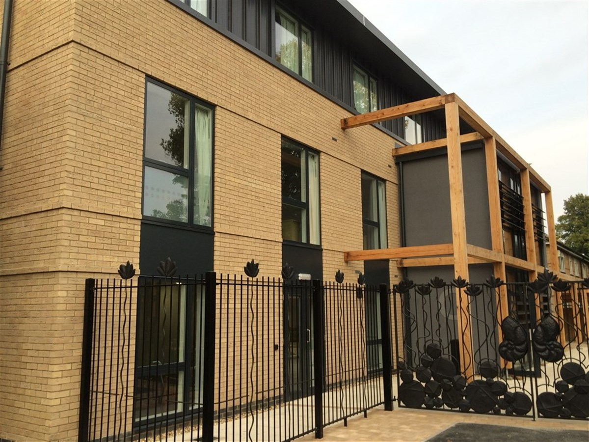
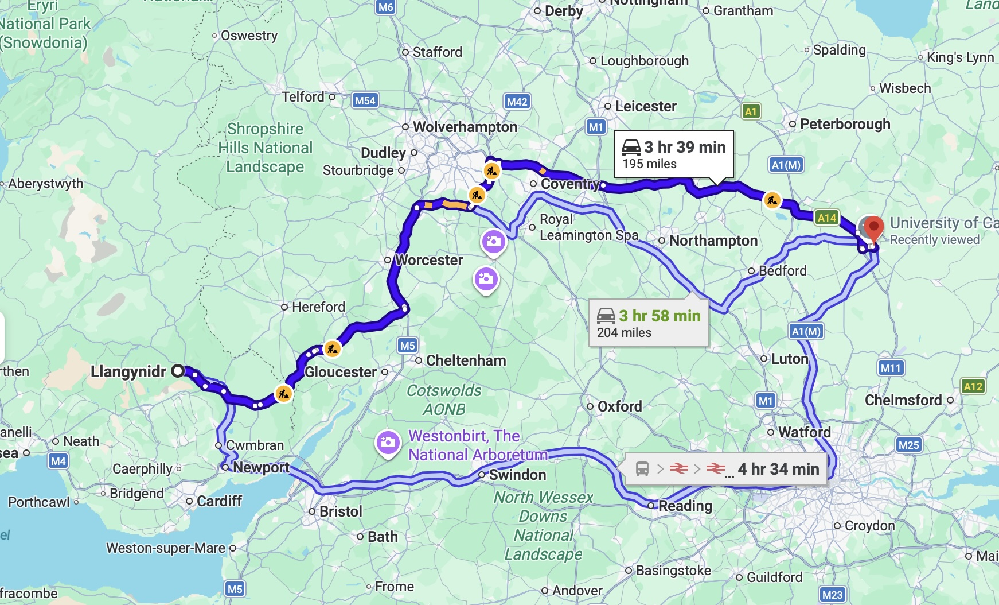

<H1>My Time in Cambridge</H1>

  From 2015 to 2018, I lived in
<a href="https://www.britannica.com/place/Cambridge-England">Cambridge</a>
  with my family. My mom was attending the
  <a href="https://www.cam.ac.uk">University of Cambridge</a>
  to study English.

  In August, 2018, my family moved from our home in
  <a href="https://www.cityoflancasterpa.gov">Lancaster, Pennsylvania</a>
  to Cambridge. We stayed with my grandfather in his house in
  <a href="https://www.mon-and-brec-canal.wales/llangynidr/">Llangynidr, Wales</a>,
  for a few weeks. Then we drove to our new house on Histon Road.

Here is an image of our old house:

This is the route we took from my grandfather's house to Cambridge:

<h1>The University of Cambirdge</h1> 
> The City of Cambridge is historically associated with one of the oldest and most prestigous universities in the world. 

